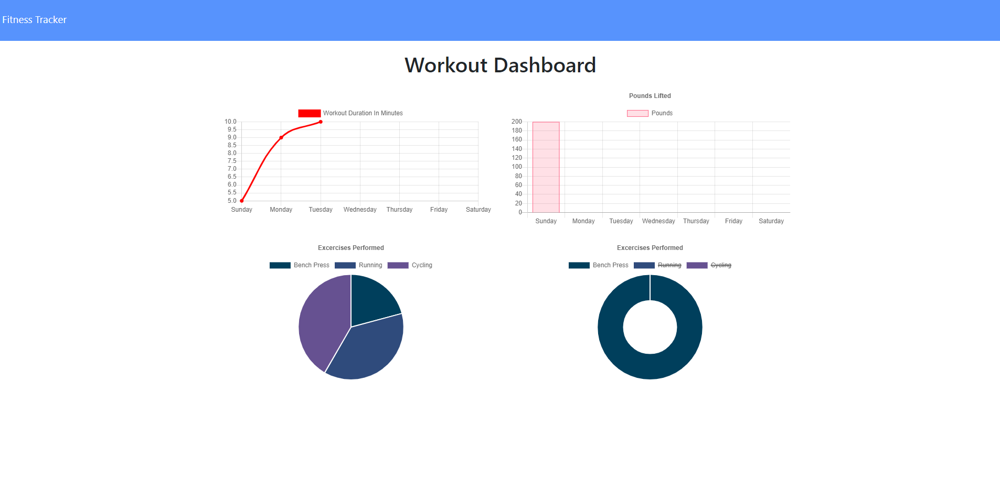
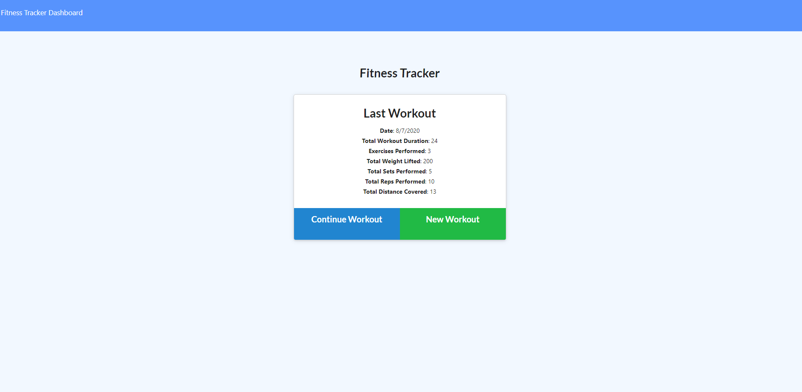
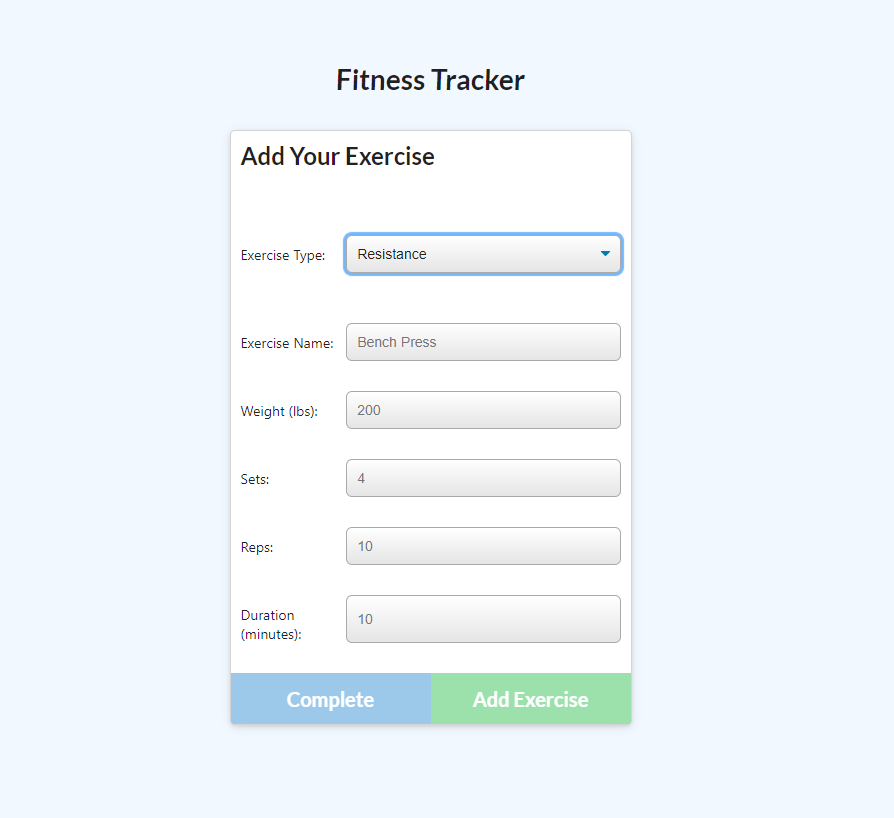

# Workout Tracker

The purpose of this assignment is to create a workout tracker using Mongo database with a Mongoose schema and handle routes with Express. A consumer will reach their fitness goals quicker when they track their workout progress.

## User Story

* As a user, he is able to view create and track daily workouts. He is able to log multiple exercises in a workout on a given day.He can also track the name, type, weight, sets, reps, and duration of exercise. If the exercise is a cardio exercise, he can track his distance traveled.

# Getting Started

### Prerequisite
1. *Javascript*
2. *HTML*
2. *Node*
3. *Express*
4. *Mongoose*
5. *morgan*
6. *MongoDb*

# Project Details

When the user loads the page, they are given the option to create a new workout, or continue with their last workout.

The user are able to:

  * Add exercises to a previous workout plan.

  * Add new exercises to a new workout plan.

  * View multiple the combined weight of multiple exercises on the `stats` page.

![deployed application] ()

